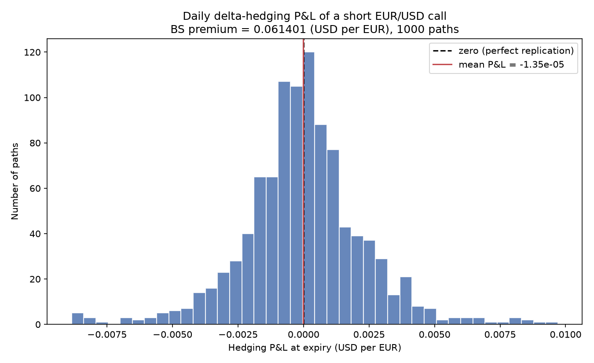
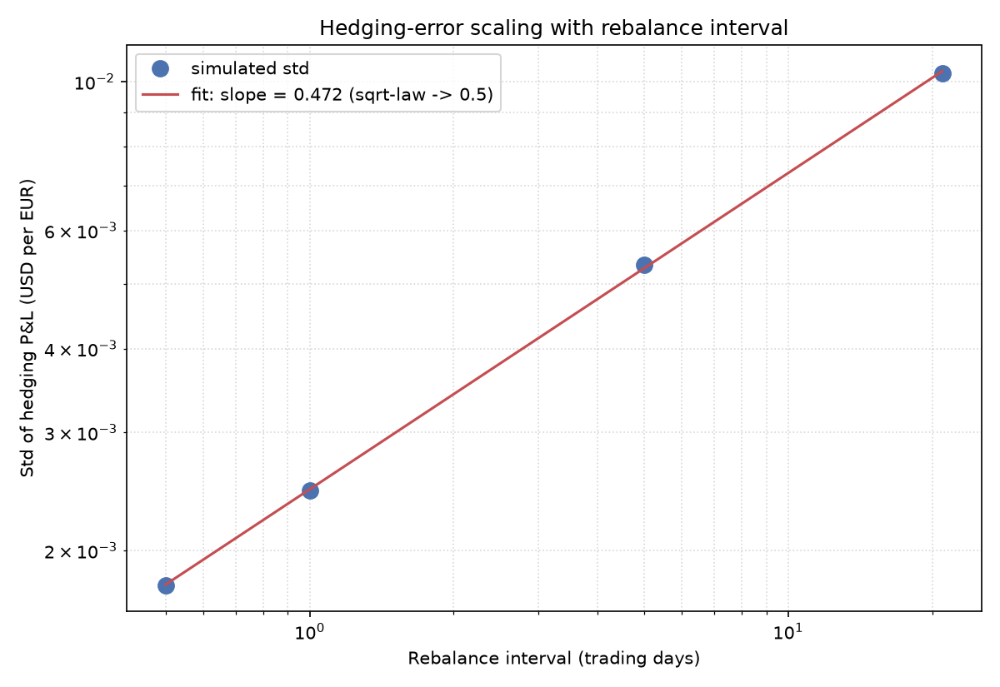
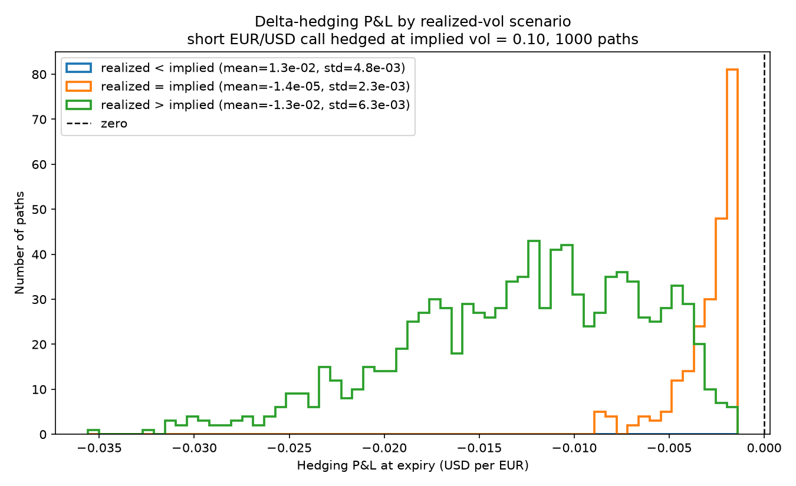
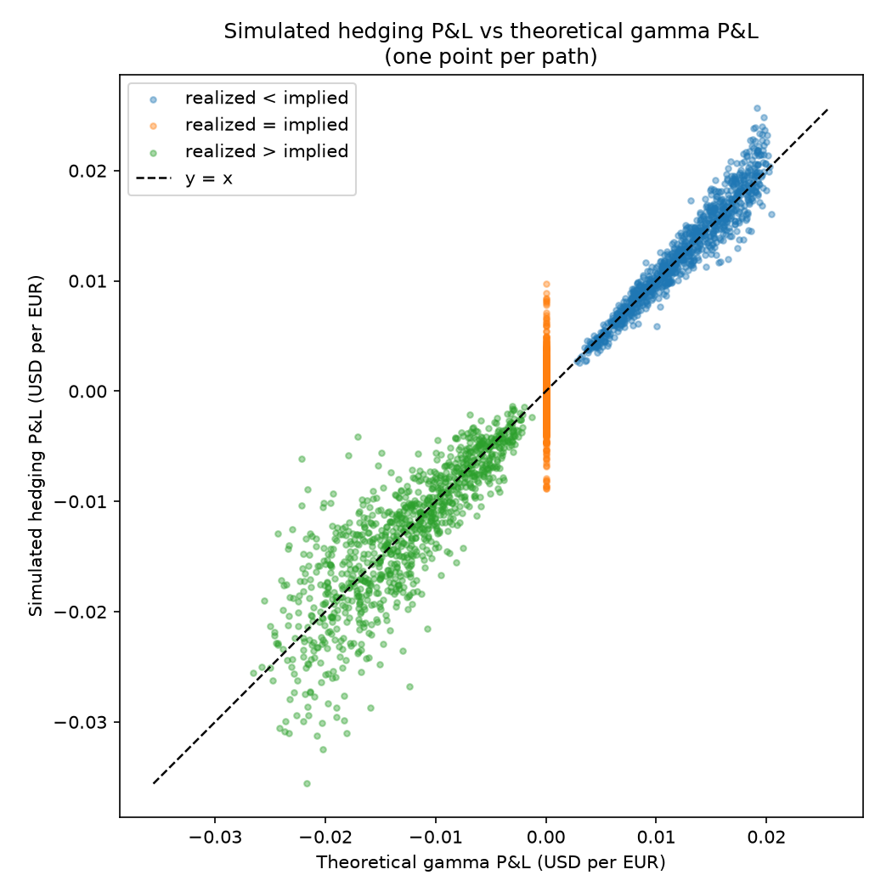
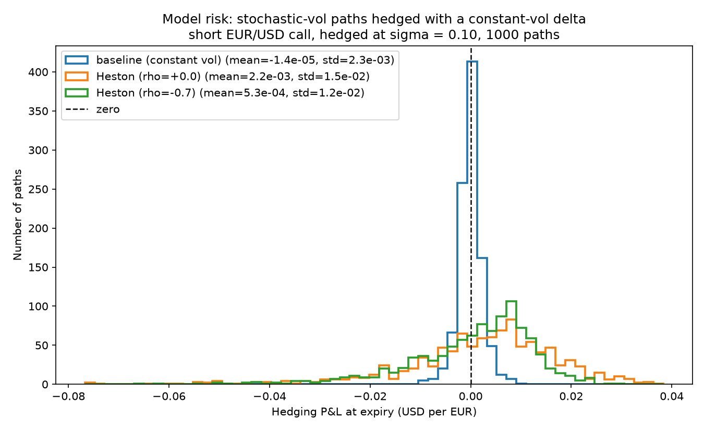

# Delta-Hedging Simulator

A Monte Carlo study of how well a Black–Scholes delta hedge actually replicates an
option, and where it breaks down. We sell one European call, hedge it day by day, and
look at the leftover P&L across a thousand simulated paths. Each phase drops one of the
textbook assumptions — continuous rebalancing, known constant vol, the right model — and
measures what that costs the hedger.

## The contract

Everything is built around a single, near-the-money one-year call on **EUR/USD**, quoted
in USD per EUR (so `S0 = 1.10` means 1.10 USD buys 1 EUR):

| | |
|---|---|
| Spot `S0` | 1.10 |
| Strike `K` | 1.10 (at-the-money) |
| Rate `r` | 3% continuously compounded |
| Vol `sigma` | 10% annual |
| Expiry `T` | 1 year |
| Steps | 252 (one rebalance per trading day) |
| Paths | 1000 Monte Carlo, `seed = 42` |

The hedge is **self-financing**: sell the call, pocket the Black–Scholes premium, hold
`delta` units of spot with the rest in cash, and rebalance over time. Whatever is left
after liquidating at expiry and paying the call holder is the **hedging error**. If
Black–Scholes were exactly right and we rebalanced continuously, that error would be zero.
All the parameters live in [src/config.py](./src/config.py).

## Setup

```bash
python -m venv .venv && source .venv/bin/activate
pip install -r requirements.txt
```

Each phase is its own runnable module. Figures are written to [figures/](./figures/) and
summary tables to [results/](./results/).

```bash
python -m src.main          # Phase 1
python -m src.main_phase2   # Phase 2
python -m src.main_phase3   # Phase 3
python -m src.main_phase4   # Phase 4
```

## The phases

### Phase 1 — Constant vol, daily hedge ([src/main.py](./src/main.py))

The baseline run. Simulate constant-vol GBM paths, hedge each one daily with the BS delta
at the same vol we priced the option with, and check that the mean P&L sits essentially at
zero. It does: mean P&L comes out around −0.02% of the premium, with a std of 0.0023
against a premium of 0.0614. The hedge is unbiased and what's left is just discretization
noise.



### Phase 2 — Rebalancing frequency and the sqrt-law ([src/main_phase2.py](./src/main_phase2.py))

Hedge the *same* underlying paths at four frequencies — monthly, weekly, daily,
twice-daily — so frequency is the only thing that changes. The error shrinks the more
often you trade, and it does so on a schedule: the error std scales like the square root
of the rebalance interval. The log-log fit of std against interval lands at a slope of
~0.5, which is the sqrt-law.

| Frequency | Interval (days) | Std (% of premium) |
|---|---|---|
| Monthly | 21 | 16.8% |
| Weekly | 5 | 8.7% |
| Daily | 1 | 4.0% |
| Twice-daily | 0.5 | 2.9% |



### Phase 3 — Implied vs. realized vol and the gamma P&L ([src/main_phase3.py](./src/main_phase3.py))

Split the two volatilities apart: price and hedge at a fixed implied vol of 10%, but let
the underlying actually move at a different realized vol. The hedged P&L shifts off zero,
and that shift is the gamma P&L. We compare the mean simulated P&L to the closed-form
gamma P&L scenario by scenario and they line up.

| Scenario | Realized vol | Mean simulated P&L | Theoretical gamma P&L |
|---|---|---|---|
| realized < implied | 7% | +0.0125 | +0.0124 |
| realized = implied | 10% | ≈ 0 | 0 |
| realized > implied | 13% | −0.0127 | −0.0125 |

Calmer-than-charged markets pay you, wilder ones cost you, and the amount is the gamma P&L
almost exactly.




### Phase 4 — Model risk: stochastic vol hedged with a constant-vol delta ([src/main_phase4.py](./src/main_phase4.py))

Here the underlying follows Heston (stochastic variance, CIR), but the desk keeps hedging
with the Phase 1 constant-vol delta — the hedge code is reused unchanged, only the
path-generation model changes. The parameters are set so the average vol still matches the
baseline, so the only new thing is that vol is now random. That alone widens the P&L
distribution and gives it a fat, negatively skewed left tail. Against the constant-vol
baseline, the leverage case (`rho = −0.7`) has roughly 5x the error std and a 6x worse
1%-tail loss. Getting the average vol right isn't enough — the randomness of vol is its
own risk.



## Layout

```
src/
  config.py          # all the contract / simulation knobs (Params dataclass)
  black_scholes.py   # closed-form call price, delta, gamma
  paths.py           # GBM (Phase 1) and Heston (Phase 4) path simulators
  hedge.py           # self-financing delta hedge + theoretical gamma P&L
  plotting.py        # shared figure helpers
  main.py            # Phase 1 orchestrator
  main_phase2.py     # Phase 2 orchestrator
  main_phase3.py     # Phase 3 orchestrator
  main_phase4.py     # Phase 4 orchestrator
figures/             # generated plots
results/             # generated summary CSVs
```

## Modeling notes

- FX is priced as plain Black–Scholes with a single rate (the underlying is treated like a
  non-dividend-paying asset). The proper Garman–Kohlhagen treatment, with the EUR rate as a
  dividend yield, is a natural extension.
- Subsampling for Phase 2 is exact, not an approximation: between rebalances delta is held
  fixed, so only the spots on the hedge dates affect the P&L.
- Heston variance is stepped with the full-truncation Euler scheme (Lord et al. 2010), so
  the chosen parameters can legitimately violate the Feller condition without the square
  root ever seeing a negative variance.
